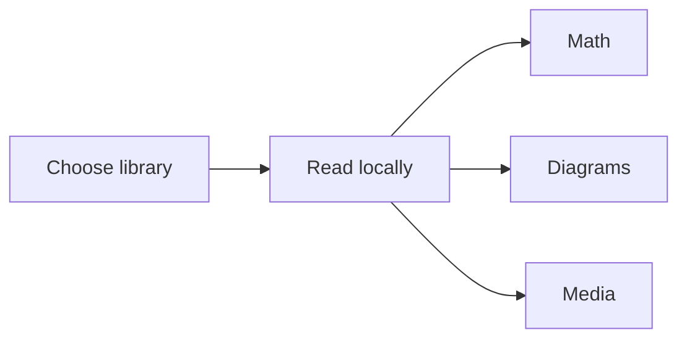

# Kainnne LumaReader Feature Matrix

English · 繁體中文 · 简体中文 · 日本語 · 한국어

> [!NOTE]
> The reader keeps documents local while presenting them with a polished visual system.

## Common Markdown

- [x] Task lists
- [ ] Open task
- Emoji: :sparkles: :book:
- Superscript: E = mc^2^
- Subscript: H~2~O
- Abbreviation: HTML

*[HTML]: HyperText Markup Language

| Feature | Status |
| --- | --- |
| Tables | Working |
| Syntax highlighting | Working |

```javascript
const reader = "Kainnne LumaReader";
console.log(reader);
```

## Mathematics

Inline math: $e^{i\pi}+1=0$.

$$
\int_{-\infty}^{\infty} e^{-x^2}\,dx = \sqrt{\pi}
$$

## Diagram



## Local media


## Include

!INCLUDE "included-note.md"

## Footnote

The selected folder remains under user control.[^local]

[^local]: The desktop app listens only on the loopback interface.
